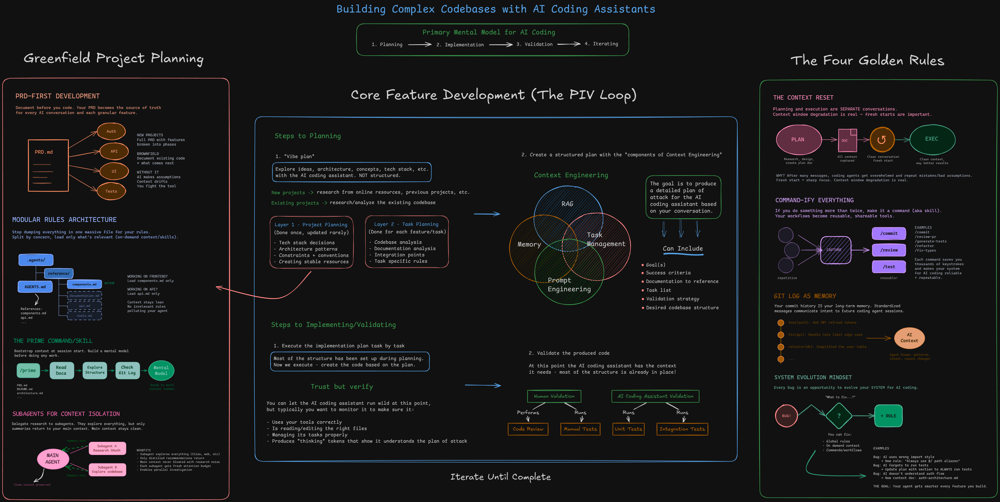

# Advanced Claude Code Techniques for 2026

**AI Coding Summit 2026 Workshop** | March 3, 2026 | 2 Hours



A hands-on workshop on agentic coding - how to delegate all coding to an AI agent while staying in the driver's seat. No vibe coding. You'll learn a structured system where every mistake the agent makes is an opportunity to improve the system itself, making your coding agent more reliable over time.

## What You'll Learn

### The PIV Loop: Plan, Implement, Validate

The core workflow that separates productive AI-assisted development from "vibe coding":

1. **Plan** - Create context-rich implementation plans that give the agent everything it needs to succeed on the first pass. Not just "build me X" - structured plans with architecture references, code patterns, validation commands, and acceptance criteria.

2. **Implement** - Delegate all coding to the AI coding assistant. This is a trust-but-verify approach - the agent writes the code, but it's following your structured plan which includes the full validation strategy so it can check its own work along the way.

3. **Validate** - The AI validation pyramid. Have the AI coding assistant check as much as possible automatically - linting, type checking, running tests, verifying against acceptance criteria. You step in at the top of the pyramid for code reviews and manual testing. The agent does the heavy lifting; you do the final quality pass.

### Golden Nuggets

- **Context Reset** - Reset the context between planning and implementation. Context is the most precious resource when working with AI coding assistants - don't pollute your implementation context with all the research and exploration from planning.
- **Git Log as Memory** - Your commit history is context the agent can use. Structure it well.
- **Commandify Everything** - Turn your repeatable workflows into reusable commands. This repo includes a full set of commands as a starting point.
- **System Evolution Mindset** - Every bug from the AI coding assistant isn't just something to fix - it's an opportunity to address the root cause in your system. Update your rules, commands, skills, or whatever caused the issue so it never happens again.
- **The Sandwich Principle** - You own the planning and validation; the agent owns the implementation. That's how you stay in control while still delegating all the coding.

## Workshop Exercise: Poll Builder App

We'll build a **poll/survey builder** from scratch - a web application where users can create polls, share them via link, and see real-time results with visualizations.

### Why This Use Case?

- **Not trivially one-shottable** - Has auth, CRUD, relational data (votes), public sharing, and data visualization. Vibe coding this would be a mess.
- **Clear PIV loop demonstration** - Natural phases that show how planning pays off
- **Visually satisfying** - You see polls, votes, and charts come to life as we build
- **Interactive** - We can use the app we build to poll the workshop audience live

### What We'll Build

We'll create the PRD for the poll builder from scratch, then take that PRD and run a full PIV loop to build out the initial application - authentication, poll creation, voting, and results visualization.

## Prerequisites

Before the workshop, make sure you have:

- [ ] **Git and GitHub** installed and configured
- [ ] **An AI coding assistant** installed - preferably [Claude Code](https://docs.anthropic.com/en/docs/claude-code/overview) (CLI), but any AI coding tool works
- [ ] **Node.js 18+** (or Bun) installed
- [ ] A code editor (VS Code, Cursor, etc.)

### Optional (for following along exactly)

- [ ] Claude Pro or Max subscription (for Claude Code access)
- [ ] A database tool (we'll use SQLite for simplicity, no setup needed)

## Repository Structure

```
ai-coding-summit-workshop-2/
├── .claude/
│   ├── CLAUDE-template.md          # Template for creating project rules
│   ├── commands/
│   │   ├── prime.md                # /prime - Load codebase context
│   │   ├── create-prd.md          # /create-prd - Generate a PRD
│   │   ├── create-rules.md        # /create-rules - Generate CLAUDE.md
│   │   ├── plan-feature.md        # /plan-feature - Create implementation plan
│   │   ├── execute.md             # /execute - Execute a plan step-by-step
│   │   ├── init-project.md        # /init-project - Set up and start locally
│   │   └── commit.md              # /commit - Create atomic git commits
│   └── skills/
│       ├── agent-browser/         # Browser automation for testing
│       │   └── SKILL.md
│       └── e2e-test/              # End-to-end testing orchestration
│           └── SKILL.md
└── README.md
```

### Commands Explained

These are reusable prompts (slash commands) that encode your workflow:

| Command | Purpose | When to Use |
|---------|---------|-------------|
| `/prime` | Load full codebase context into the agent | Start of session, before planning |
| `/create-prd` | Generate a Product Requirements Document | Starting a new project (greenfield) |
| `/create-rules` | Generate CLAUDE.md global rules from codebase | After project setup, to establish conventions |
| `/plan-feature` | Create a detailed implementation plan | Before implementing any feature |
| `/execute` | Execute a plan step-by-step with validation | After plan is approved |
| `/init-project` | Install deps, start servers, validate setup | First time setting up locally |
| `/commit` | Stage changes and create an atomic commit | After completing and validating a feature |

### Skills Explained

Skills give the agent specialized capabilities beyond code editing:

| Skill | Purpose |
|-------|---------|
| **agent-browser** | Automate browser interactions - navigate pages, fill forms, click buttons, take screenshots. Used for manual testing and verification. |
| **e2e-test** | Full end-to-end testing orchestration - launches parallel agents to research the codebase, then systematically tests every user journey with browser automation and database validation. |

## The Workshop Flow

1. **Overview (~20 min)** - High-level overview of agentic coding, the PIV loop, and why structure beats speed
2. **PRD Creation (~20 min)** - Live demo: creating a PRD for the poll builder from scratch
3. **PIV Loop Build (~40 min)** - Live PIV loop: plan, implement, and validate to build out the initial application
4. **Golden Nuggets & Q&A (~40 min)** - Key takeaways, tips, and audience questions

## About the Instructor

**Cole Medin** - AI Engineering educator and content creator. Runs the [Dynamous community](https://dynamous.ai) and creates YouTube content about AI coding and agentic engineering. Previously presented "Advanced Claude Code techniques: agentic engineering with context driven development" at AI Coding Summit 2025.

## Resources

- [AI Coding Summit 2025 Workshop Repo](https://github.com/coleam00/ai-coding-summit-workshop) (last year's workshop)
- [Cole's YouTube Channel](https://www.youtube.com/@ColeMedin)
- [Dynamous Community](https://dynamous.ai)
